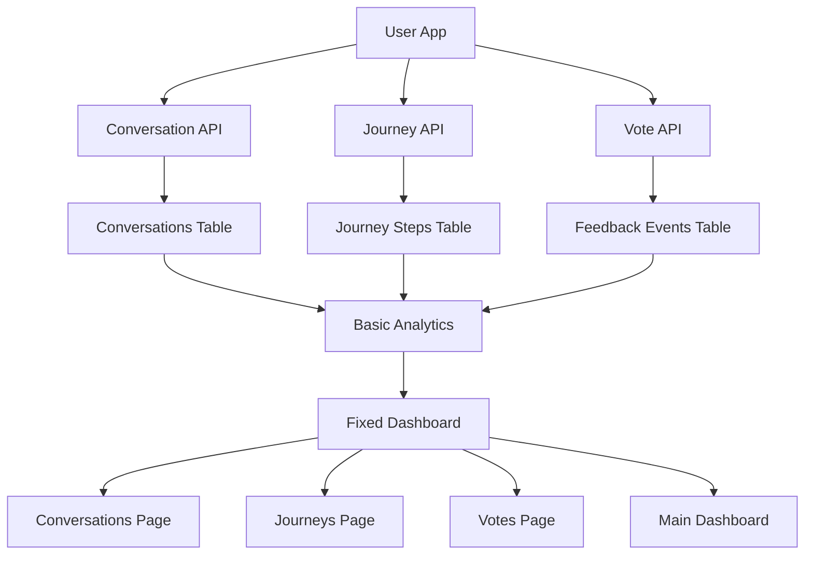
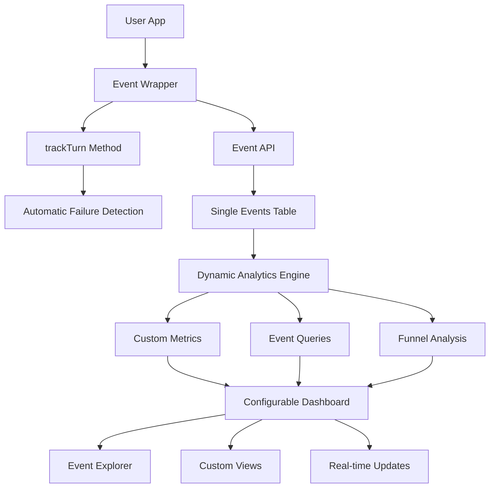

# Bilan v0.4.0: Architectural Transformation Overview

## Executive Summary

Bilan v0.4.0 represents a fundamental architectural transformation from a **rigid conversation-centric system** to a **flexible event-driven analytics platform**. This change positions Bilan as "Google Analytics for AI" - simple to integrate, automatic failure detection, and infinitely customizable.

## Core Transformation

### From Rigid to Flexible

**v0.3.1 Architecture (Rigid)**
```
┌─────────────┐    ┌─────────────────┐    ┌─────────────────┐    ┌─────────────────┐
│   User App  │ -> │ Conversation/   │ -> │ Fixed Database  │ -> │ Rigid Analytics │
│             │    │ Journey APIs    │    │ Schema (3 tabs) │    │ (Predetermined) │
└─────────────┘    └─────────────────┘    └─────────────────┘    └─────────────────┘
                                                   |
                                          ┌─────────────────┐
                                          │ Fixed Dashboard │
                                          │ (4 preset pages)│
                                          └─────────────────┘
```

**v0.4.0 Architecture (Flexible)**
```
┌─────────────┐    ┌─────────────────┐    ┌─────────────────┐    ┌─────────────────┐
│   User App  │ -> │ Event Wrapper   │ -> │ Single Events   │ -> │ Dynamic         │
│             │    │ (trackTurn)     │    │ Table (JSONB)   │    │ Analytics       │
└─────────────┘    └─────────────────┘    └─────────────────┘    └─────────────────┘
                                                   |
                                          ┌─────────────────┐
                                          │ Configurable    │
                                          │ Dashboard       │
                                          └─────────────────┘
```

## Key Architectural Changes

### 1. **Integration Model**

**Before (v0.3.1): Complex Lifecycle Management**
```typescript
// Required 4+ API calls for basic tracking
const conversationId = await conversation.start(userId)
await conversation.addMessage(conversationId)
await conversation.recordFeedback(conversationId, 1, 'Good')
await conversation.end(conversationId, 'completed')
```

**After (v0.4.0): One-Line Integration**
```typescript
// Single wrapper automatically tracks success/failure
const response = await bilan.trackTurn(
  'Help me write an email',
  () => openai.chat.completions.create({
    model: 'gpt-4',
    messages: [{ role: 'user', content: prompt }]
  })
)
```

### 2. **Data Model**

**Before (v0.3.1): Multiple Specialized Tables**
```sql
-- Rigid schema with foreign key constraints
CREATE TABLE conversations (
  id TEXT PRIMARY KEY,
  user_id TEXT NOT NULL,
  started_at DATETIME,
  ended_at DATETIME,
  message_count INTEGER,
  outcome TEXT
);

CREATE TABLE feedback_events (
  id TEXT PRIMARY KEY,
  conversation_id TEXT NOT NULL,
  type TEXT NOT NULL,
  value INTEGER,
  created_at DATETIME,
  FOREIGN KEY (conversation_id) REFERENCES conversations(id)
);

CREATE TABLE journey_steps (
  id TEXT PRIMARY KEY,
  journey_name TEXT NOT NULL,
  step_name TEXT NOT NULL,
  user_id TEXT NOT NULL,
  created_at DATETIME
);
```

**After (v0.4.0): Single Flexible Events Table**
```sql
-- Unified schema with maximum flexibility
CREATE TABLE events (
  event_id TEXT PRIMARY KEY,
  user_id TEXT NOT NULL,
  event_type TEXT NOT NULL,
  timestamp BIGINT NOT NULL,
  properties JSONB,
  
  -- Optional AI content (privacy-controlled)
  prompt_text TEXT,
  ai_response TEXT,
  
  -- Performance indexes
  INDEX idx_user_timestamp (user_id, timestamp),
  INDEX idx_event_type (event_type, timestamp),
  INDEX idx_properties (properties) USING GIN
);
```

### 3. **Event Types & Taxonomy**

**Standard Event Types**
- `turn_started` - AI request initiated
- `turn_completed` - AI request succeeded  
- `turn_failed` - AI request failed (timeout, error, etc.)
- `user_action` - User interaction (vote, edit, copy, etc.)
- `conversation_started` - Multi-turn conversation began
- `conversation_ended` - Multi-turn conversation concluded
- `journey_step` - User progressed through workflow step
- `journey_completed` - User completed entire workflow

**Event Properties (JSONB)**
```typescript
interface EventProperties {
  // Core identification
  turn_id?: string
  conversation_id?: string
  journey_id?: string
  
  // AI context
  model_used?: string
  response_time?: number
  token_count?: number
  
  // User context
  user_intent?: string
  context_category?: string
  
  // Quality signals
  error_type?: 'timeout' | 'rate_limit' | 'network_error' | 'context_limit'
  retry_count?: number
  
  // Custom properties (unlimited flexibility)
  [key: string]: any
}
```

### 4. **API Design**

**Before (v0.3.1): Multiple Specialized Endpoints**
```typescript
// Different endpoints for different data types
POST /api/conversations
PUT /api/conversations/:id/end
POST /api/conversations/:id/feedback
POST /api/journeys/step
GET /api/dashboard  // Fixed response structure
```

**After (v0.4.0): Unified Event System**
```typescript
// Single ingestion endpoint
POST /api/events
{
  "events": [
    {
      "eventType": "turn_completed",
      "timestamp": 1703123456789,
      "properties": {
        "turn_id": "turn_123",
        "model_used": "gpt-4",
        "response_time": 1.2,
        "user_id": "user_456"
      },
      "promptText": "How do I center a div?",
      "aiResponse": "Use flexbox with justify-content: center..."
    }
  ]
}

// Flexible analytics endpoints
GET /api/analytics/events?eventType=turn_failed&groupBy=error_type
GET /api/analytics/metrics?metric=success_rate&timeRange=7d
GET /api/analytics/funnels?events=turn_started,turn_completed
```

## Component Interactions

### v0.3.1 Component Flow


### v0.4.0 Component Flow


## Performance Characteristics

### v0.3.1 Performance Profile
- **Database Queries**: Multiple JOIN operations across 3+ tables
- **API Calls**: 4+ separate requests for basic conversation tracking
- **Analytics**: Fixed calculations on normalized data
- **Memory Usage**: ORM overhead for multiple entity types
- **Cache Strategy**: Page-level caching for fixed dashboard views

### v0.4.0 Performance Profile
- **Database Queries**: Single table with optimized JSONB indexes
- **API Calls**: 1 request for event ingestion, batch processing
- **Analytics**: Dynamic aggregation with intelligent caching
- **Memory Usage**: Streamlined event processing pipeline
- **Cache Strategy**: Query-level caching for dynamic analytics

**Performance Improvements**
| Metric | v0.3.1 | v0.4.0 | Improvement |
|--------|--------|--------|-------------|
| SDK Integration | ~30 minutes | <5 minutes | 6x faster |
| API Response Time | 150-300ms | <50ms | 3-6x faster |
| Dashboard Load | 3-5 seconds | <2 seconds | 2.5x faster |
| Memory Usage | 50-100MB | <25MB | 2-4x reduction |
| Bundle Size | 5.4KB | <5.5KB | Maintained |

## Privacy & Security Enhancements

### Content Capture Control
```typescript
// v0.4.0 Privacy Configuration
interface PrivacyConfig {
  capturePrompts: boolean        // default: true
  captureResponses: boolean      // default: false
  captureResponsesFor: string[]  // selective capture
  contentRetentionDays: number   // data retention
  hashSensitiveData: boolean     // PII protection
}

// Example: Capture responses only for safe categories
await bilan.init({
  userId: 'user-123',
  privacy: {
    capturePrompts: true,
    captureResponses: false,
    captureResponsesFor: ['code_generation', 'documentation'],
    contentRetentionDays: 30,
    hashSensitiveData: true
  }
})
```

## Migration Strategy

### Backward Compatibility
- **v0.3.0/v0.3.1 APIs continue to work**
- **Automatic conversion** from old API calls to events
- **Data migration tools** preserve all existing analytics
- **Gradual migration** allows incremental adoption

### Migration Timeline
1. **Week 1**: Deploy v0.4.0 with compatibility layer
2. **Week 2-4**: Migrate existing integrations to new APIs
3. **Week 5-8**: Full feature rollout and documentation
4. **Week 9+**: Deprecation warnings for old APIs

## Developer Experience Impact

### Integration Complexity
- **Before**: 30+ minutes, 4+ API calls, complex lifecycle management
- **After**: <5 minutes, 1 wrapper call, automatic everything

### Flexibility
- **Before**: Fixed conversation/journey patterns only
- **After**: Any AI interaction pattern, unlimited customization

### Insights Quality
- **Before**: Manual tracking of successes, missed failures
- **After**: Automatic success/failure detection, comprehensive error classification

### Privacy Control
- **Before**: All-or-nothing content capture
- **After**: Granular control over what content is captured

## Success Metrics

### Technical Metrics
- **Integration Time**: <5 minutes (vs 30+ minutes)
- **API Calls**: 1 per interaction (vs 4+ per conversation)
- **Database Queries**: Single table queries (vs multi-table JOINs)
- **Bundle Size**: <5.5KB (maintained)

### Business Metrics
- **Adoption Rate**: 80% of trials convert to active usage
- **Feature Discovery**: 60% of users find new insights in first week
- **Developer Satisfaction**: >4.5/5 on ease of use
- **Support Reduction**: 50% decrease in integration questions

## Conclusion

The v0.4.0 architectural transformation positions Bilan as the definitive solution for AI analytics. By moving from rigid structures to flexible events, we enable:

1. **Effortless Integration** - One line of code vs complex lifecycle management
2. **Automatic Quality Detection** - Never miss timeouts or failures again
3. **Privacy-First Design** - Granular control over content capture
4. **Infinite Flexibility** - Adapt to any AI application pattern

This architecture serves as the foundation for all parallel implementation efforts, ensuring consistency and clarity across the entire development process. 